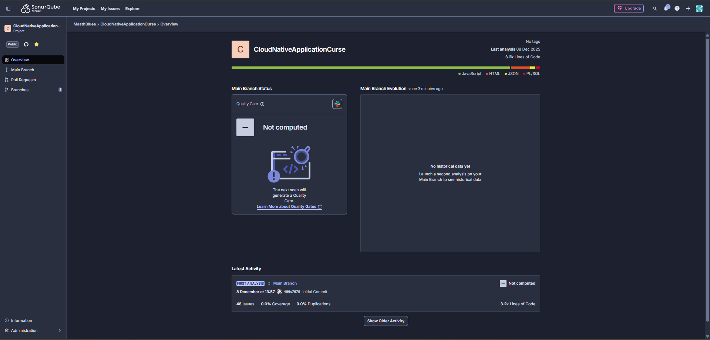
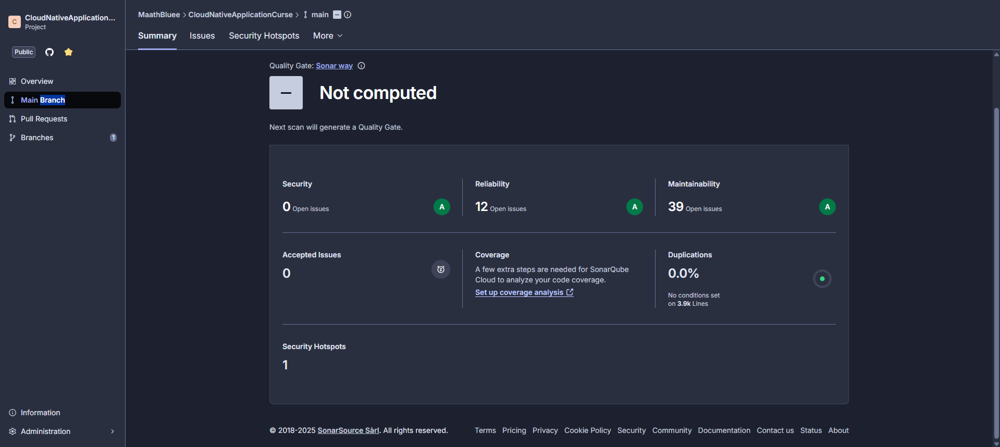
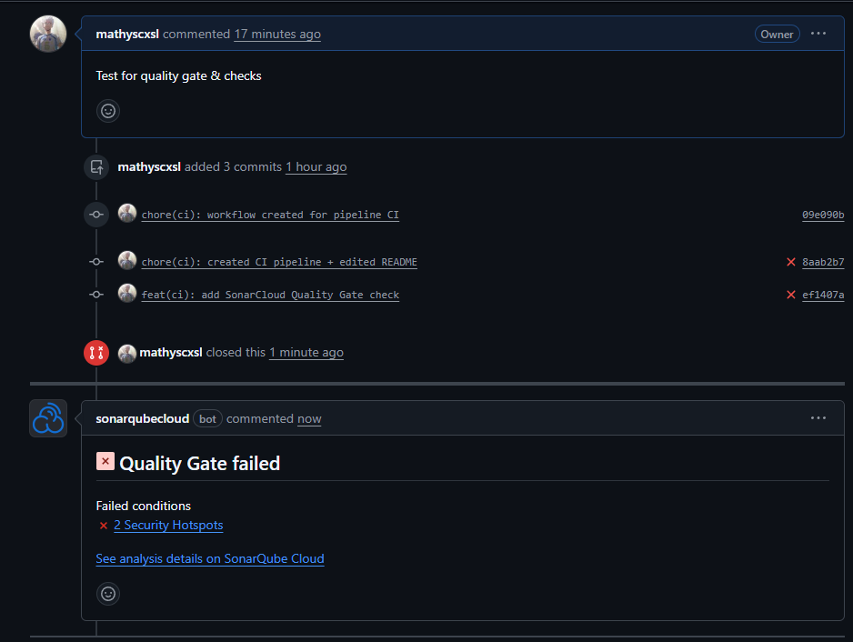
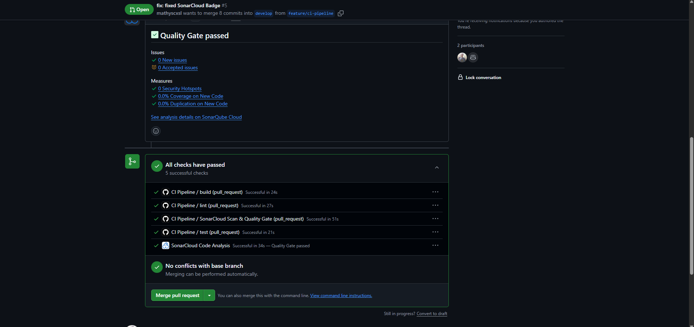
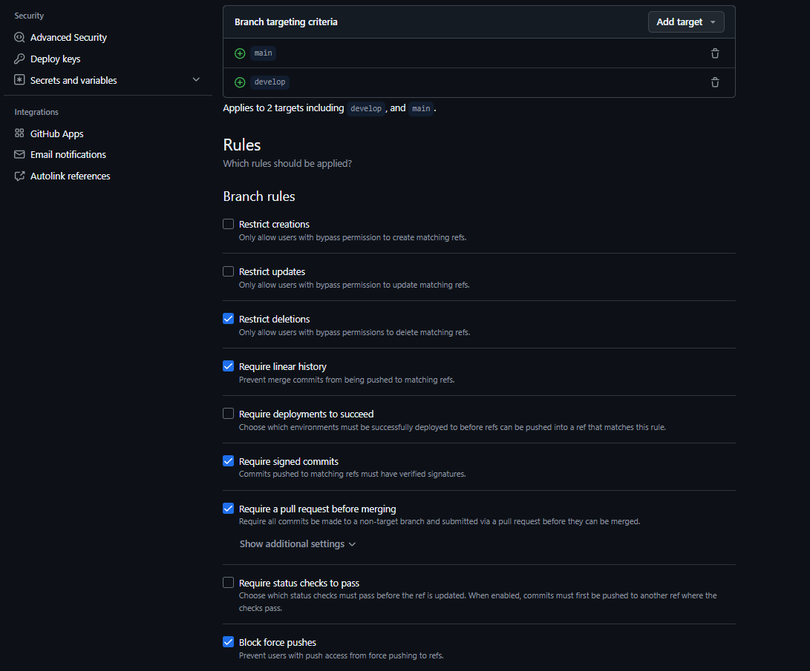
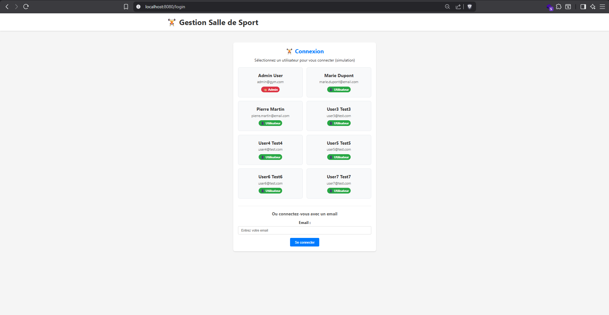
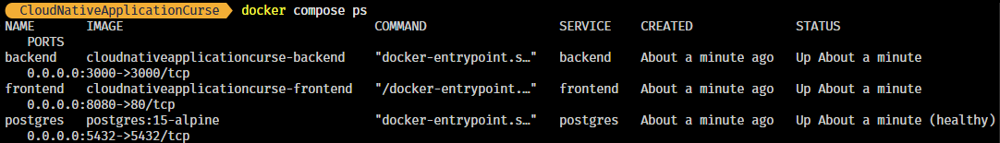
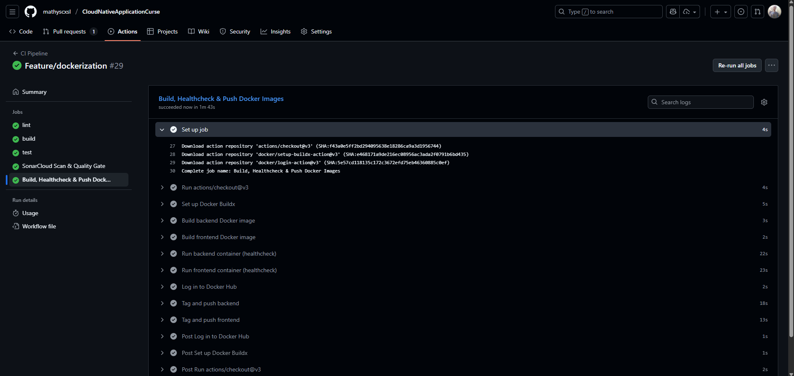
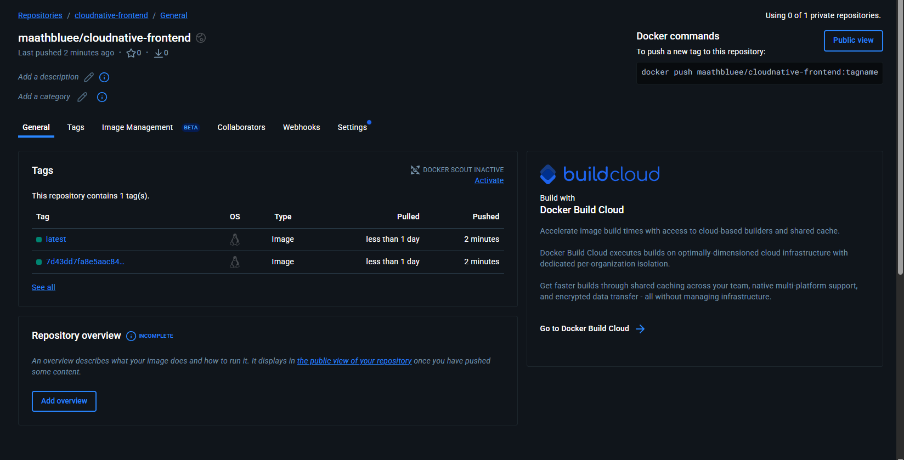
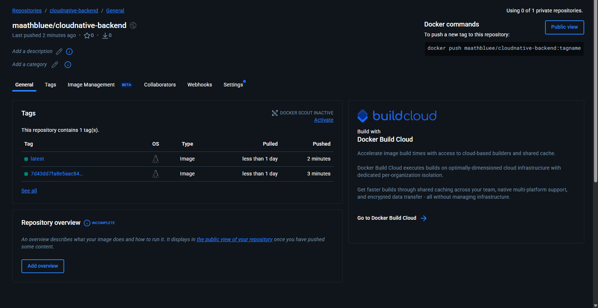

# README.md du Projet

---

Ce TP documente les règles Git, la convention de commit, les hooks activés dans ce dépôt, et présente l’application Gym Management System.

---

# ✔ TP1 Git & Workflow Rules

## ✔ Règles Git utilisées

- Branches principales : `main`, `develop`
- Branches de feature : `feature/<nom>` (ex. `feature/init-husky`)
- PR obligatoire vers `develop`
- Pas de commit direct sur `main` ou `develop`

## ✔ Convention de commit

Exemples :

- `feat: ajout de l’authentification`
- `fix: correction de la connexion Postgres`
- `chore: mise à jour des dépendances NestJS`

## ✔ Hooks actifs

- `pre-commit` : lint front + back
- `commit-msg` : vérification commitlint

---

# ✔ TP2 – CI, SonarCloud & Quality Gate

## 📸 Captures d’écran

### SonarCloud – Overview du projet

### SonarCloud – Détails Quality Gate

### GitHub – Pull Request avec Quality Gate failed (Security Hotspots)

### GitHub – Tous les checks passent (CI build, lint, test, SonarCloud)

### GitHub – Branch Protection Rules (main & develop)

---

# ✔ TP3 – CI/CD Docker & Publication des images sur Docker Hub

### 🔐 Secrets utilisés

| Nom du Secret       | Utilité                  |
| ------------------- | ------------------------ |
| `DOCKER_USERNAME`   | Nom du compte Docker Hub |
| `DOCKER_PAT`        | Token d’accès Docker Hub |
| `SONAR_TOKEN`       | Analyseur SonarCloud     |
| `POSTGRES_PASSWORD` | CI + tests               |

### 🐳 Images générées et poussées

- `mathyscxsl/cloudnative-backend:latest`
- `mathyscxsl/cloudnative-backend:<sha>`
- `mathyscxsl/cloudnative-frontend:latest`
- `mathyscxsl/cloudnative-frontend:<sha>`

---

## 📸 Captures d’écran TP3 – Docker Hub

### Application

---

### Commande "docker compose ps"

---

### Pipeline Docker

---

### Docker Hub – Images poussées dans le registre (frontend)

---

### Docker Hub – Images poussées dans le registre (backend)

---

# Gym Management System

A complete fullstack gym management application built with modern web technologies.

## Features

### User Features

- **User Dashboard**: View stats, billing, and recent bookings
- **Class Booking**: Book and cancel fitness classes
- **Subscription Management**: View subscription details and billing
- **Profile Management**: Update personal information

### Admin Features

- **Admin Dashboard**: Overview of gym statistics and revenue
- **User Management**: CRUD operations for users
- **Class Management**: Create, update, and delete fitness classes
- **Booking Management**: View and manage all bookings
- **Subscription Management**: Manage user subscriptions

### Business Logic

- **Capacity Management**: Classes have maximum capacity limits
- **Time Conflict Prevention**: Users cannot book overlapping classes
- **Cancellation Policy**: 2-hour cancellation policy
- **Billing System**: Dynamic pricing with no-show penalties
- **Subscription Types**: Standard (€30), Premium (€50), Student (€20)

## Tech Stack

### Backend

- Node.js + Express.js
- Prisma ORM + PostgreSQL
- MVC + Repository pattern

### Frontend

- Vue.js 3
- Pinia
- Vue Router
- Responsive CSS

### DevOps

- Docker
- Docker Compose
- PostgreSQL
- Nginx

---

# Quick Start

Instructions d’installation et exécution (inchangées)...

---

# Contributing

1. Fork
2. Branch feature
3. PR
4. Tests
5. Merge

---

# License

MIT

---

# Support

Pour toute question, merci d’ouvrir une issue.
